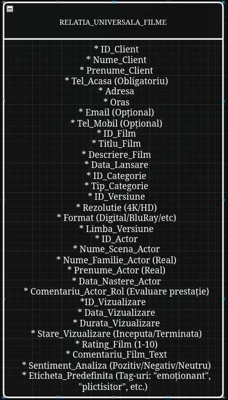

# Referat Proiect: Platformă vizualizare filme (Proiect 4)
**Curs:** Sisteme de gestiune a bazelor de date  
**Student:** Stupu Eduard-Stefan  

## 1. Descrierea cerintelor de business:  
Proiectul vizează realizarea unei platforme informatice pentru gestionarea unui catalog de filme, a interacțiunilor utilizatorilor cu acestea și a procesului de
recomandare inteligentă. Sistemul este construit pentru a servi atât administratorilor platformei, cât și utilizatorilor finali (clienți).

### 1.1. Obiectivele Sistemului
* **Managementul Multidimensional al Catalogului:** Gestionarea filmelor (titlu, descriere, categorie, data lansării) și a versiunilor acestora (formate, rezoluții 4K/HD,
  variante lingvistice/subtitrări). Include calculul automat al rating-ului general pe baza voturilor clienților.
* **Monitorizarea Performanței Artistice:** Evidența actorilor (nume de scenă, date personale) și evaluarea critică a prestației acestora prin comentarii specifice fiecărui
  rol interpretat.
* **Sistem Avansat de CRM (Customer Relationship Management):** Urmărirea profilului clientului (nume, adrese fizice detaliate pe orașe, multiple numere de telefon) și a
  istoricului de consum (data accesării, versiunea aleasă, durata vizualizării și frecvența vizionărilor).
* **Motor de Analiză Comportamentală și Emoțională:** Implementarea unui sistem hibrid de feedback compus din rating numeric, analiză critică textuală (Sentiment Analysis
  bazat pe cuvinte-cheie) și opțiuni predefinite bifabile (ex: "interesant", "scenariu slab", "emoționant").
* **Inteligență în Recomandări și Predicții:** Gruparea utilizatorilor după similarități (preferințe de gen, actori urmăriți, profil emoțional) pentru generarea de
  recomandări personalizate și realizarea de prognoze sezoniere (estimarea volumului de vizualizări în perioade de sărbători sau vacanțe).
* **Procesare la Nivel de Server (Data-Centric Logic):** Mutarea întregii logici de calcul statistic, a analizei de sentiment și a sistemului de recomandare la nivel de
  server de baze de date, prin implementarea de proceduri stocate și funcții PL/pgSQL, asigurând performanță și integritate.

### 1.2. Reguli de Business și Logică de Funcționare
Pentru a asigura o proiectare riguroasă a bazei de date, au fost identificate următoarele reguli ce guvernează funcționarea platformei:

1. **Gestiunea Catalogului și a Versiunilor:** Un film este caracterizat prin titlu, descriere, categorie și data lansării. Unicitatea conținutului este nuanțată prin
   existența mai multor versiuni disponibile pentru vizualizare (formate diferite, rezoluții 4K/HD sau variante lingvistice/subtitrări distincte). Rating-ul general al
   unui film nu este stocat static, ci este calculat dinamic pe baza voturilor agregate de la clienți.

2. **Managementul Actorilor și a Prestației Artistice:** Pentru fiecare actor se rețin datele de identificare (nume de scenă, nume real, prenume) și data nașterii. Sistemul
   permite o evaluare granulară a muncii acestora prin înregistrarea comentariilor specifice referitoare la rolul interpretat într-un anumit film, oferind o imagine de
   ansamblu asupra aprecierii prestației artistice a fiecărui actor.

3. Profilul Detaliat al Clientului: Identificarea clienților în sistem necesită obligatoriu numele, prenumele, un număr de telefon fix (de acasă), adresa completă și
   orașul. Opțional, se pot colecta adresa de e-mail și numărul de telefon mobil. Această structură permite o evidență clară a utilizatorilor și a distribuției lor
   geografice.

4. Monitorizarea Consumului (Istoric Vizualizări): Sistemul urmărește fiecare interacțiune a clientului cu un film, înregistrând data vizualizării, versiunea tehnică
   selectată, durata vizionării și starea acesteia (completă/întreruptă). Un client poate accesa mai multe filme, iar un film poate fi urmărit de același client de mai
   multe ori, la intervale diferite, generând un istoric complet al activității.

5. Sistemul Hibrid de Feedback și Vot: Clienții pot evalua filmele și actorii prin trei modalități simultane:
* Un rating numeric pentru calculul mediilor.
* O analiză critică textuală (comentariu liber) pentru detalii calitative.
* O selecție de opțiuni predefinite (checkbox-uri) care descriu experiența subiectivă (ex: "mi-a plăcut", "emoționant", "plictisitor", "scenariu slab").

6. Analiza Emoțională și de Sentiment (Keywords): La nivelul serverului de baze de date (PL/pgSQL), comentariile și etichetele bifate sunt procesate prin identificarea
   unor cuvinte-cheie relevante. Rezultatul este clasificarea automată a sentimentului utilizatorului (Pozitiv, Negativ sau Neutru), analiză ce poate fi aplicată la
   nivel de film, categorie, actor sau profil de utilizator.

7. Calculul Similarității și Recomandări Personalizate: Utilizatorii sunt grupați automat pe baza similarităților dintre preferințele lor. Această similaritate este
   calculată analizând categoriile vizualizate frecvent, frecvența vizualizărilor, scorurile acordate, emoțiile identificate în feedback și aprecierile față de anumiți
   actori. Rezultatul permite generarea de recomandări de filme între utilizatori cu profiluri cinematografice similare.

8. Predicții și Estimări Sezoniere: Aplicația realizează previziuni privind succesul anumitor filme în perioade specifice ale anului (sărbători, vacanțe, intervale
   sezoniere). Aceste estimări se bazează pe analiza datelor istorice de vizualizare, pe popularitatea categoriilor și pe reacțiile anterioare ale clienților în contexte
   temporale similare.

9. Logica Centralizată (Server-Side Statistics): Toate calculele statistice, clasificările de sentiment și algoritmii de recomandare sau predicție sunt implementați
   exclusiv la nivelul bazei de date sub formă de proceduri stocate și funcții complexe, aplicația client având rolul de a prelua și afișa rezultatele finale.

### 2. Normalizarea Schemei Bazei de Date

Procesul de proiectare a bazei de date a urmat etapele de normalizare pentru a elimina redundanța și a preveni anomaliile de actualizare.

2.1. Relația Universală (R)

2.2. Identificarea Dependențelor Funcționale (DF)
Analizând regulile de business din secțiunea 1.2, stabilim următoarele dependențe:
* DF1: ID_Client -> Nume_C, Prenume_C, Tel_Acasa, Adresa, Oras, Email, Tel_Mobil
* DF2: ID_Film -> Titlu, Descriere, Data_Lansare, ID_Categorie
* DF3: ID_Categorie -> Nume_Categorie
* DF4: ID_Versiune -> ID_Film, Rezolutie, Limba
* DF5: ID_Actor -> Nume_Scena, Prenume_A, Nume_A, Data_Nastere_A
* DF6: ID_Client, ID_Film, Data_Vizualizare -> ID_Versiune, Durata
* DF7: ID_Client, ID_Film -> Rating, Comentariu_Text, Sentiment

2.3. Aplicarea Algoritmului de Descompunere (BCNF)
Relația universală nu este în BCNF deoarece există dependențe unde determinantul nu este o cheie candidată pentru întreaga relație. Aplicăm descompunerea succesivă:

1. Clienti(ID_Client, Nume_C, Prenume_C, Tel_Acasa, Adresa, Oras, Email, Tel_Mobil)
2. Categorii(ID_Categorie, Nume_Categorie)
3. Filme(ID_Film, Titlu, Descriere, Data_Lansare, ID_Categorie)
4. Versiuni_Film(ID_Versiune, ID_Film, Rezolutie, Limba)
5. Actori(ID_Actor, Nume_Scena, Prenume_A, Nume_A, Data_Nastere_A)

2.4. Dependențe Multivaluate și Forma Normală 4 (4NF)
Conform cerințelor din !proiect, un film are mai mulți actori, iar un client poate asocia mai multe etichete feedback-ului. Pentru a atinge 4NF, izolăm aceste relații:

1. Distributie(ID_Film, ID_Actor, Comentariu_Prestatie)
2. Vizualizari(ID_Vizualizare, ID_Client, ID_Versiune, Data_Vizualizare, Durata)
3. Feedback_Voturi(ID_Feedback, ID_Client, ID_Film, Rating, Comentariu_Text, Sentiment)
4. Caracterizari_Selectate(ID_Feedback, Eticheta)

Rezultat: Schema finală este compusă din 9 tabele normalizate, pregătite pentru implementarea în PostgreSQL.