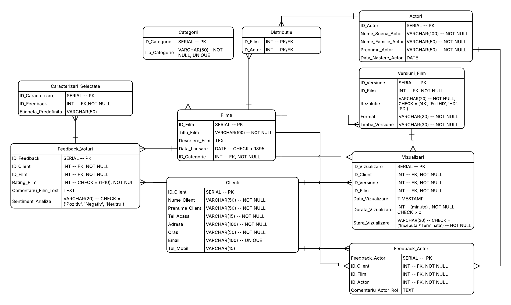
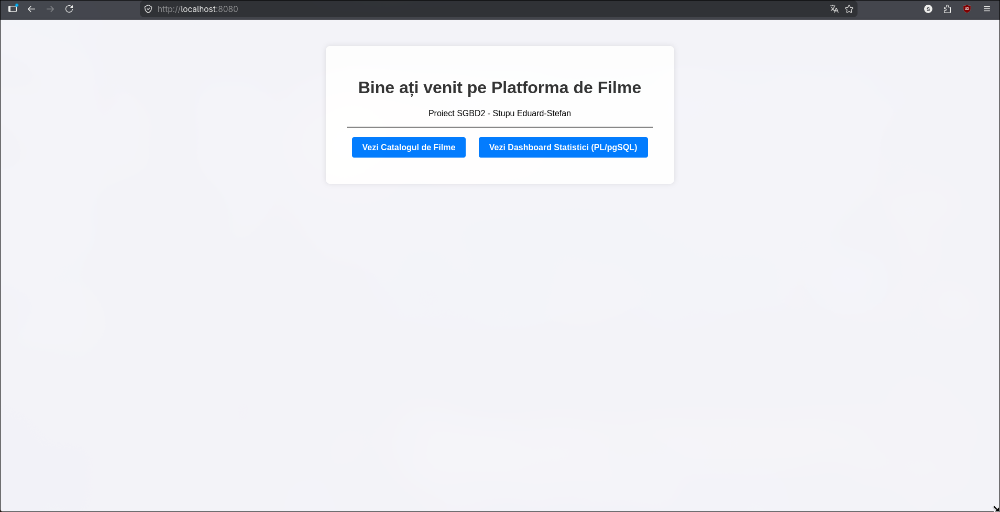
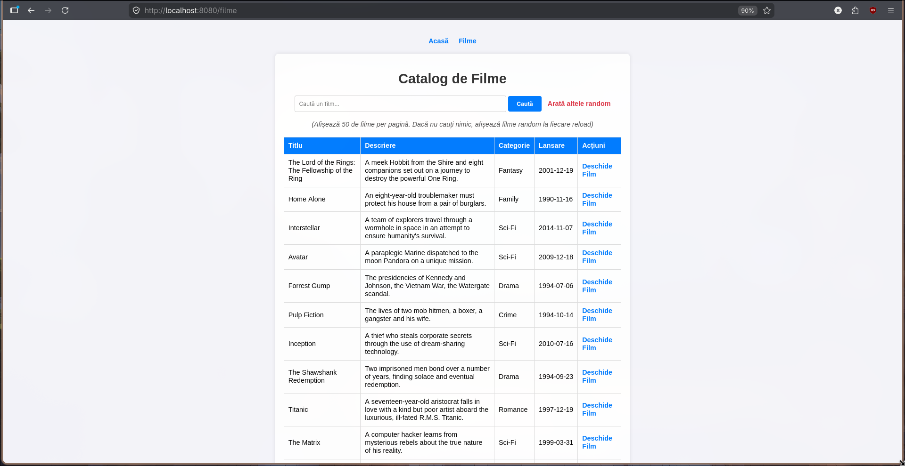
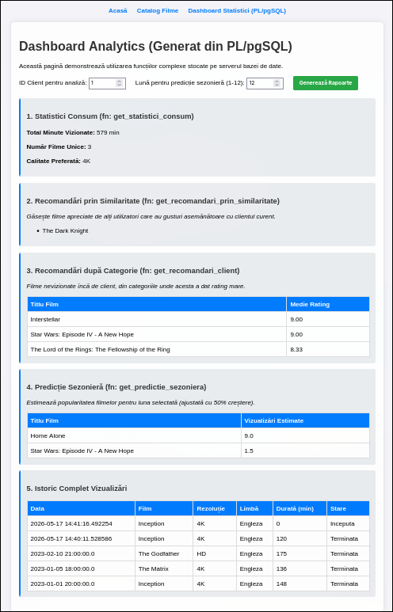
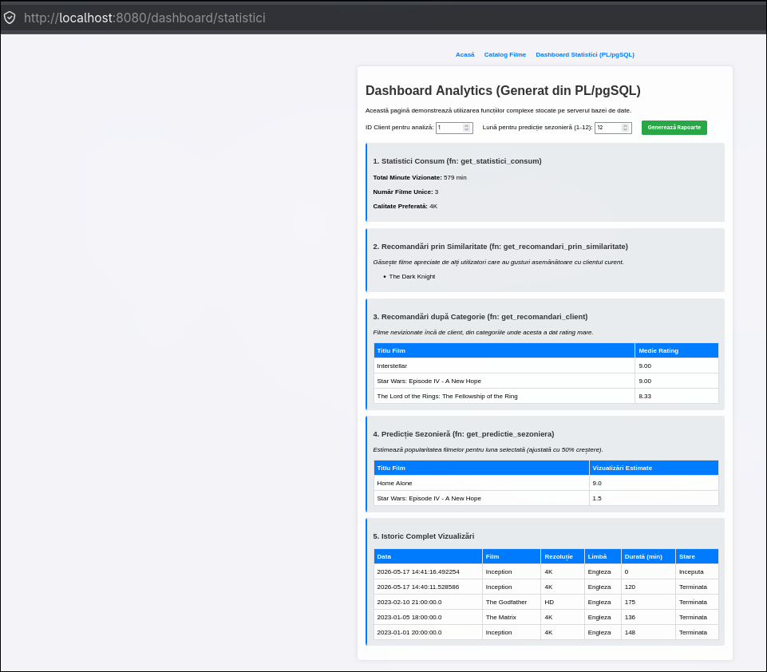

# Referat Proiect: Platformă vizualizare filme (Proiect 4)
**Curs:** Sisteme de gestiune a bazelor de date  
**Student:** Stupu Eduard-Stefan  

## 1. Descrierea cerintelor de business:  
Proiectul vizează realizarea unei platforme informatice pentru gestionarea unui catalog de filme, a interacțiunilor utilizatorilor cu acestea și a procesului de
recomandare inteligentă. Sistemul este construit pentru a servi atât administratorilor platformei, cât și utilizatorilor finali (clienți).

### 1.1. Obiectivele Sistemului
* **Managementul Multidimensional al Catalogului:** Gestionarea filmelor (titlu, descriere, categorie, data lansării) și a versiunilor acestora (formate, rezoluții 4K/HD,
  variante lingvistice/subtitrări). Include calculul automat al rating-ului general pe baza voturilor clienților.
* **Monitorizarea Performanței Artistice:** Evidența actorilor (nume de scenă, date personale) și evaluarea critică a prestației acestora prin comentarii specifice fiecărui
  rol interpretat.
* **Sistem Avansat de CRM (Customer Relationship Management):** Urmărirea profilului clientului (nume, adrese fizice detaliate pe orașe, multiple numere de telefon) și a
  istoricului de consum (data accesării, versiunea aleasă, durata vizualizării și frecvența vizionărilor).
* **Motor de Analiză Comportamentală și Emoțională:** Implementarea unui sistem hibrid de feedback compus din rating numeric, analiză critică textuală (Sentiment Analysis
  bazat pe cuvinte-cheie) și opțiuni predefinite bifabile (ex: "interesant", "scenariu slab", "emoționant").
* **Inteligență în Recomandări și Predicții:** Gruparea utilizatorilor după similarități (preferințe de gen, actori urmăriți, profil emoțional) pentru generarea de
  recomandări personalizate și realizarea de prognoze sezoniere (estimarea volumului de vizualizări în perioade de sărbători sau vacanțe).
* **Procesare la Nivel de Server (Data-Centric Logic):** Mutarea întregii logici de calcul statistic, a analizei de sentiment și a sistemului de recomandare la nivel de
  server de baze de date, prin implementarea de proceduri stocate și funcții PL/pgSQL, asigurând performanță și integritate.

### 1.2. Reguli de Business și Logică de Funcționare
Pentru a asigura o proiectare riguroasă a bazei de date, au fost identificate următoarele reguli ce guvernează funcționarea platformei:

1. **Gestiunea Catalogului și a Versiunilor:** Un film este caracterizat prin titlu, descriere, categorie și data lansării. Unicitatea conținutului este nuanțată prin
   existența mai multor versiuni disponibile pentru vizualizare (formate diferite, rezoluții 4K/HD sau variante lingvistice/subtitrări distincte). Rating-ul general al
   unui film nu este stocat static, ci este calculat dinamic pe baza voturilor agregate de la clienți.

2. **Managementul Actorilor și a Prestației Artistice:** Pentru fiecare actor se rețin datele de identificare (nume de scenă, nume real, prenume) și data nașterii. Sistemul
   permite o evaluare granulară a muncii acestora prin înregistrarea comentariilor specifice referitoare la rolul interpretat într-un anumit film, oferind o imagine de
   ansamblu asupra aprecierii prestației artistice a fiecărui actor.

3. **Profilul Detaliat al Clientului:** Identificarea clienților în sistem necesită obligatoriu numele, prenumele, un număr de telefon fix (de acasă), adresa completă și
   orașul. Opțional, se pot colecta adresa de e-mail și numărul de telefon mobil. Această structură permite o evidență clară a utilizatorilor și a distribuției lor
   geografice.

4. **Monitorizarea Consumului (Istoric Vizualizări):** Sistemul urmărește fiecare interacțiune a clientului cu un film, înregistrând data vizualizării, versiunea tehnică
   selectată, durata vizionării și starea acesteia (completă/întreruptă). Un client poate accesa mai multe filme, iar un film poate fi urmărit de același client de mai
   multe ori, la intervale diferite, generând un istoric complet al activității.

5. **Sistemul Hibrid de Feedback și Vot:** Clienții pot evalua filmele și actorii prin trei modalități simultane:
* Un rating numeric pentru calculul mediilor.
* O analiză critică textuală (comentariu liber) pentru detalii calitative.
* O selecție de opțiuni predefinite (checkbox-uri) care descriu experiența subiectivă (ex: "mi-a plăcut", "emoționant", "plictisitor", "scenariu slab").

6. **Analiza Emoțională și de Sentiment (Keywords):** La nivelul serverului de baze de date (PL/pgSQL), comentariile și etichetele bifate sunt procesate prin identificarea
   unor cuvinte-cheie relevante. Rezultatul este clasificarea automată a sentimentului utilizatorului (Pozitiv, Negativ sau Neutru), analiză ce poate fi aplicată la
   nivel de film, categorie, actor sau profil de utilizator.

7. **Calculul Similarității și Recomandări Personalizate:** Utilizatorii sunt grupați automat pe baza similarităților dintre preferințele lor. Această similaritate este
   calculată analizând categoriile vizualizate frecvent, frecvența vizualizărilor, scorurile acordate, emoțiile identificate în feedback și aprecierile față de anumiți
   actori. Rezultatul permite generarea de recomandări de filme între utilizatori cu profiluri cinematografice similare.

8. **Predicții și Estimări Sezoniere:** Aplicația realizează previziuni privind succesul anumitor filme în perioade specifice ale anului (sărbători, vacanțe, intervale
   sezoniere). Aceste estimări se bazează pe analiza datelor istorice de vizualizare, pe popularitatea categoriilor și pe reacțiile anterioare ale clienților în contexte
   temporale similare.

9. **Logica Centralizată (Server-Side Statistics):** Toate calculele statistice, clasificările de sentiment și algoritmii de recomandare sau predicție sunt implementați
   exclusiv la nivelul bazei de date sub formă de proceduri stocate și funcții complexe, aplicația client având rolul de a prelua și afișa rezultatele finale.

### 2. Normalizarea Schemei Bazei de Date

Procesul de proiectare a bazei de date a urmat etapele de normalizare pentru a elimina redundanța și a preveni anomaliile de actualizare.

### 2.1. **Relația Universală (R)**  
Conform metodologiei de proiectare, pornim de la o singură relație care conține toate atributele brute. Această stare este una nenormalizată, prezentând riscuri majore de
redundanță și anomalii la inserare, ștergere și modificare.


### 2.2. **Identificarea Dependențelor Funcționale (DF)**
Analizând regulile de business din secțiunea 1.2, stabilim următoarele dependențe:

* **DF1:** ID_Client -> Nume_C, Prenume_C, Tel_Acasa, Adresa, Oras, Email, Tel_Mobil
    
    **Explicație:** Datele de identificare și contact depind de ID-ul unic al clientului.

*   **DF2:** ID_Film -> Titlu, Descriere, Data_Lansare, ID_Categorie

    **Explicație:** Metadatele filmului sunt determinate de ID-ul acestuia.

* **DF3:** ID_Categorie -> Tip_Categorie

    **Explicație:** Denumirea/Tipul genului depinde de ID-ul categoriei.

* **DF4:** ID_Versiune -> ID_Film, Rezolutie, Format, Limba

    **Explicație:** O versiune tehnică este o resursă specifică unui film, având format și rezoluție proprii.

* **DF5:** ID_Actor -> Nume_Scena, Prenume_A, Nume_A, Data_Nastere_A

    **Explicație:** Informațiile biografice ale actorului sunt determinate de ID-ul său.

* **DF6:** ID_Client, ID_Film, Data_Vizualizare -> ID_Versiune, Durata, Stare_Vizualizare

    **Explicație:** Determină varianta vizionată, cât a durat și dacă a fost finalizată.

* **DF7:** ID_Client, ID_Film -> Rating, Comentariu_Text, Sentiment

    **Explicație:** Un client acordă un single set de feedback (notă, text, sentiment) pentru un anumit film.

* **DF8:** ID_Client, ID_Film, ID_Actor -> Comentariu_Actor_Rol
  
    **Explicație:** Comentariul asupra prestației artistice depinde de combinația dintre filmul vizionat și actorul evaluat.

### 2.3. Aplicarea Algoritmului de Descompunere (BCNF)
* O relație este în BCNF dacă pentru orice dependență funcțională netrivială $X \to Y$, $X$ este o cheie candidată.  
* Relația universală nu este în BCNF deoarece există dependențe unde determinantul nu este o cheie candidată pentru întreaga relație. Aplicăm descompunerea succesivă:


1. **Clienti** (ID_Client, Nume_Client, Prenume_Client, Tel_Acasa, Adresa, Oras, Email, Tel_Mobil)
2. **Categorii** (ID_Categorie, Tip_Categorie)
3. **Filme** (ID_Film, Titlu_Film, Descriere_Film, Data_Lansare, ID_Categorie)
4. **Versiuni_Film** (ID_Versiune, ID_Film, Rezolutie, Format, Limba_Versiune)
5. **Actori** (ID_Actor, Nume_Scena_Actor, Nume_Familie_Actor, Prenume_Actor, Data_Nastere_Actor)

### 2.4. Dependențe Multivaluate și Forma Normală 4 (4NF)
* O relație este în 4NF dacă este în BCNF și pentru orice dependență multivaluată netrivială $X \twoheadrightarrow Y$, $X$ este o cheie candidată.
* Schema rezultată din BCNF prezintă riscuri de redundanță din cauza listelor independente (ex: un film are mai mulți actori și mai multe etichete de feedback). Pentru a
  evita multiplicarea rândurilor prin produs cartezian, am aplicat descompunerea pentru a izola aceste dependențe:


1. **Distributie** (ID_Film, ID_Actor)  
    ***Explicație:*** Am creat acest tabel pentru a gestiona relația de tip Many-to-Many dintre filme și actori.

2. **Feedback_Actori** (ID_Client, ID_Film, ID_Actor, Comentariu_Actor_Rol)  
**Explicație:** Acest tabel izolează opiniile subiective ale clienților despre prestația unui actor specific într-un anumit film. 

3. **Vizualizari** (ID_Vizualizare, ID_Client, ID_Versiune,ID_Film, Data_Vizualizare, Durata_Vizualizare, Stare_Vizualizare)  
   **Explicație:**  Am separat aceste date deoarece vizualizările sunt evenimente multiple și independente
   care depind de tripletul (Client, Versiune, Timp), evitând astfel repetarea inutilă a datelor de profil ale clientului la fiecare vizionare.

4. **Feedback_Voturi** (ID_Feedback, ID_Client, ID_Film, Rating_Film, Comentariu_Film_Text, Sentiment_Analiza)  
   **Explicație:** Separarea feedback-ului de istoricul vizualizărilor permite clienților să lase o singură recenzie per film,
   facilitând calculul mediei de rating și execuția algoritmilor de analiză de sentiment la nivel de server.

5. **Caracterizari_Selectate** (ID_Feedback, Eticheta_Predefinita)  
   **Explicație:** Un singur feedback poate avea mai multe etichete asociate simultan (ex: "emoționant" și
   "interesant"), am izolat această dependență multivaluată pentru a preveni redundanța masivă în tabelul principal de feedback.

### 3. Diagrama Entitate-Asociere (UML) și Schema Conceptuală

În această etapă, am transpus regulile de normalizare într-un model vizual care reflectă arhitectura bazei de date și relațiile dintre entități.

3.1. Diagrama UML a Sistemului



### 3.2. Descrierea Entităților și a Asocierilor
Modelul este format din 10 entități, grupate logic pentru a asigura performanța și integritatea:

1. Entități de Catalog: Filme, Categorii, Versiuni_Film, Actori. Acestea stochează datele de bază ale platformei.
2. Entități de Utilizatori: Clienti - stochează profilul complet al consumatorului.
3. Entități de Eveniment/Interacțiune: Vizualizari, Feedback_Voturi, Feedback_Actori. Acestea înregistrează acțiunile dinamice ale utilizatorilor.
4. Entități de Detaliu: Distributie (joncțiune M:N) și Caracterizari_Selectate (atribute multivaluate).

### 3.3. Transcrierea Relațiilor între Instanțe
Conform cerințelor, am analizat modul în care instanțele entităților interacționează la nivel de date:

* Asocierea Film - Versiune (1:N): O instanță a setului Filme (ex: filmul "Interstellar") este asociată cu mai multe instanțe din Versiuni_Film (ex: varianta "4K -
  Engleză" și varianta "HD - Română"). Reciproc, o instanță de Versiune aparține în mod obligatoriu și unic unui singur Film.
* Asocierea Categorie - Film (1:N): O instanță a setului Categorii (ex: 'Sci-Fi') se asociază cu $n$ instanțe de Filme. Un film nu poate fi creat fără a fi repartizat
  unei categorii existente.
* Asocierea Film - Actor (M:N): O instanță de Film poate avea mai multe instanțe de Actori în distribuție, iar un Actor poate juca în mai multe Filme. Această relație
  este mediată de entitatea Distributie.
* Asocierea Feedback - Caracterizări (1:N): O instanță de Feedback_Voturi poate fi descrisă prin mai multe instanțe de Etichete (ex: un singur vot poate avea bifate
  simultan opțiunile "emoționant" și "interesant").

### 3.4. Justificarea Designului și Constrângeri

Pentru a garanta calitatea datelor, am implementat toate cele 5 tipuri de constrângeri:

1. **Primary Key (PK):** Am ales chei surogat (ID-uri numerice) pentru toate tabelele.
    * Justificare: Utilizarea unui ID numeric în locul unei chei naturale (cum ar fi Numele Actorului sau Titlul Filmului) asigură stabilitatea bazei de date. Dacă un
      actor își schimbă numele, legăturile cu filmele sale nu se rup. De asemenea, joncțiunile între tabele sunt mult mai rapide pe numere întregi decât pe șiruri de
      caractere.
2. **Foreign Key (FK):** Utilizate pentru a impune integritatea referențială.
    * Exemplu: ID_Film în tabela Vizualizari.
    * Justificare: Garantează că nu putem înregistra o vizionare pentru un film care nu există în catalog, prevenind apariția datelor "orfane".
3. **Unique Constraint (UNIQUE):**
    * Exemplu: Coloana Email în Clienti și combinația (ID_Client, ID_Film) în Feedback_Voturi.
    * Justificare: Email-ul unic asigură că nu există conturi duplicate. Unicitatea perechii Client-Film în Feedback garantează că un utilizator nu poate vota de mai
      multe ori același film pentru a-i falsifica rating-ul.
4. **Not Null:**
    * Exemplu: Titlu_Film, Tel_Acasa (pentru clienți).
    * Justificare: Impune regulile de business: un film trebuie să aibă nume, iar un client trebuie să aibă obligatoriu un număr de telefon fix conform cerințelor.
5. **Check Constraint:**
    * Exemplu: Rating_Film BETWEEN 1 AND 10.
    * Justificare: Restricționează valorile introduse la un interval logic, eliminând erorile umane (ex: introducerea notei 11).

### 4. Implementarea Bazei de Date (Scriptul SQL)

În această secțiune este prezentat scriptul complet de definire a obiectelor bazei de date. Scriptul a fost conceput pentru a fi idempotent, permițând rularea repetată
fără a genera conflicte de structură.

### 4.1. Instrucțiuni de Curățare (Cleanup)
Primul pas al scriptului asigură eliminarea oricăror structuri reziduale. Utilizarea clauzei CASCADE este critică aici pentru a forța ștergerea tabelelor părinte chiar
dacă acestea sunt referențiate de chei străine.

``` sql -- Pasul 1: Curatare completa
DROP TABLE IF EXISTS caracterizari_selectate CASCADE;
DROP TABLE IF EXISTS feedback_voturi CASCADE;
DROP TABLE IF EXISTS vizualizari CASCADE;
DROP TABLE IF EXISTS feedback_actori CASCADE;
DROP TABLE IF EXISTS distributie CASCADE;
DROP TABLE IF EXISTS versiuni_film CASCADE;
DROP TABLE IF EXISTS filme CASCADE;
DROP TABLE IF EXISTS actori CASCADE;
DROP TABLE IF EXISTS clienti CASCADE;
DROP TABLE IF EXISTS categorii CASCADE;
```


### 4.2. Crearea Structurii (DDL) și Gestiunea Auto-incrementării
Am utilizat tipul de date SERIAL pentru toate cheile primare. Această alegere tehnică delega bazei de date sarcina de a crea și administra secvențele (SEQUENCE) necesare
pentru generarea automată a ID-urilor.

Codul de creare a tabelelor:

``` sql 
-- Pasul 2: Creare tabele
-- 2.1 Creare tabele intependente
CREATE TABLE Categorii (
    ID_Categorie SERIAL PRIMARY KEY,
    Tip_Categorie VARCHAR(50) NOT NULL UNIQUE
);
CREATE TABLE Clienti (
    ID_Client SERIAL PRIMARY KEY,
    Nume_Client VARCHAR(50) NOT NULL,
    Prenume_Client VARCHAR(50) NOT NULL,
    Tel_Acasa VARCHAR(15) NOT NULL,
    Adresa VARCHAR(100) NOT NULL,
    Oras VARCHAR(50) NOT NULL,
    Email VARCHAR(100) UNIQUE,
    Tel_Mobil VARCHAR(20)
);

CREATE TABLE Actori (
    ID_Actor SERIAL PRIMARY KEY,
    Nume_Scena_Actor VARCHAR(100) NOT NULL,
    Nume_Familie_Actor VARCHAR(50) NOT NULL,
    Prenume_Actor VARCHAR(50) NOT NULL,
    Data_Nastere_Actor DATE,
     -- Constrângere pentru a evita duplicatele
       CONSTRAINT unicitate_biografica_actor UNIQUE (Nume_Familie_Actor, Prenume_Actor, Data_Nastere_Actor)
   );
-- 2.2 Creare tabele dependente
CREATE TABLE Filme (
    ID_Film SERIAL PRIMARY KEY,
    Titlu_Film VARCHAR(100) NOT NULL,
    Descriere_Film TEXT,
    Data_Lansare DATE NOT NULL,
    ID_Categorie INT NOT NULL,

    -- Legătura cu tabelul părinte
    CONSTRAINT fk_categorie_film FOREIGN KEY (ID_Categorie)
           REFERENCES Categorii(ID_Categorie)
           -- Daca stergem o categorie, stergem toate filmele ce au aceeasi categorie pentru a nu avea erori
           ON DELETE CASCADE,

    -- Constrângere pentru a nu avea același film lansat în aceeași zi (evităm dublurile)
    CONSTRAINT unicitate_film UNIQUE (Titlu_Film, Data_Lansare)
);

CREATE TABLE Versiuni_Film (
    ID_Versiune SERIAL PRIMARY KEY,
    ID_Film INT NOT NULL,
    Rezolutie VARCHAR(20) NOT NULL,
    Format VARCHAR(20) NOT NULL, -- Digital, BluRay, Streaming
    Limba_Versiune VARCHAR(30) NOT NULL,

    -- Legătura cu filmul părinte
    CONSTRAINT fk_versiune_film FOREIGN KEY (ID_Film)
        REFERENCES Filme(ID_Film) ON DELETE CASCADE,

    -- Constrângere CHECK: acceptăm doar anumite standarde de calitate
    CONSTRAINT check_rezolutie CHECK (Rezolutie IN ('4K', 'HD', 'SD', '3D'))
);

CREATE TABLE Distributie (
    ID_Film INT NOT NULL,
    ID_Actor INT NOT NULL,

    -- Cheia primară este compusă din ambele ID-uri
    PRIMARY KEY (ID_Film, ID_Actor),

    CONSTRAINT fk_dist_film FOREIGN KEY (ID_Film) REFERENCES Filme(ID_Film) ON DELETE CASCADE,
    CONSTRAINT fk_dist_actor FOREIGN KEY (ID_Actor) REFERENCES Actori(ID_Actor) ON DELETE CASCADE
);

CREATE TABLE Feedback_Actori (
    Feedback_Actor SERIAL PRIMARY KEY,
    ID_Client INT NOT NULL,
    ID_Film INT NOT NULL,
    ID_Actor INT NOT NULL,
    Comentariu_Actor_Rol TEXT,

    CONSTRAINT fk_fa_client FOREIGN KEY (ID_Client) REFERENCES Clienti(ID_Client),
    CONSTRAINT fk_fa_film FOREIGN KEY (ID_Film) REFERENCES Filme(ID_Film),
    CONSTRAINT fk_fa_actor FOREIGN KEY (ID_Actor) REFERENCES Actori(ID_Actor)
);


CREATE TABLE Vizualizari (
    ID_Vizualizare SERIAL PRIMARY KEY,
    ID_Client INT NOT NULL,
    ID_Versiune INT NOT NULL,
    ID_Film INT NOT NULL,
    Data_Vizualizare TIMESTAMP NOT NULL DEFAULT CURRENT_TIMESTAMP,
    Durata_Vizualizare INT NOT NULL, -- exprimată în minute
    Stare_Vizualizare VARCHAR(20) NOT NULL,

    -- Legaturi
    CONSTRAINT fk_viz_client FOREIGN KEY (ID_Client) REFERENCES Clienti(ID_Client),
    CONSTRAINT fk_viz_versiune FOREIGN KEY (ID_Versiune) REFERENCES Versiuni_Film(ID_Versiune),
    CONSTRAINT fk_viz_film FOREIGN KEY (ID_Film) REFERENCES Filme(ID_Film),

    -- Constrângere CHECK pentru starea vizionării
    CONSTRAINT check_stare_viz CHECK (Stare_Vizualizare IN ('Inceputa', 'Terminata', 'Intrerupta')),
    -- Constrângere pentru durată (nu poate fi negativă)
    CONSTRAINT check_durata CHECK (Durata_Vizualizare >= 0)
   );


CREATE TABLE Feedback_Voturi (
    ID_Feedback SERIAL PRIMARY KEY,
    ID_Client INT NOT NULL,
    ID_Film INT NOT NULL,
    Rating_Film INT NOT NULL,
    Comentariu_Film_Text TEXT,
    Sentiment_Analiza VARCHAR(20),

    CONSTRAINT fk_feed_client FOREIGN KEY (ID_Client) REFERENCES Clienti(ID_Client),
    CONSTRAINT fk_feed_film FOREIGN KEY (ID_Film) REFERENCES Filme(ID_Film),

    -- Constrângere CHECK pentru nota acordată (1-10)
    CONSTRAINT check_rating CHECK (Rating_Film BETWEEN 1 AND 10),
    -- Regula: Un client poate lăsa o singură recenzie pentru un anumit film
    CONSTRAINT unique_feedback_client UNIQUE (ID_Client, ID_Film)
);

CREATE TABLE Caracterizari_Selectate (
    ID_Caracterizare SERIAL PRIMARY KEY,
    ID_Feedback INT NOT NULL,
    Eticheta_Predefinita VARCHAR(50) NOT NULL,

    CONSTRAINT fk_char_feedback FOREIGN KEY (ID_Feedback)
    REFERENCES Feedback_Voturi(ID_Feedback) ON DELETE CASCADE
);
```

### 4.3. Observații privind Integritatea și Optimizarea
În procesul de implementare, am aplicat următoarele decizii tehnice:
* Ordinea Creării: Tabelele sunt create respectând ierarhia dependențelor: întâi tabelele independente (Nivel 0), apoi cele care le referențiază.
* Normalizarea Vizualizărilor: Deși ID_Film putea fi dedus prin tabela Versiuni_Film, l-am inclus direct în Vizualizari pentru a optimiza viteza rapoartelor statistice
  frecvente (evitând joncțiunile multiple).
* Tratarea Ștergerilor: Am utilizat ON DELETE CASCADE în special la relația Film-Versiune și Feedback-Caracterizări, asigurând eliminarea automată a "detaliilor" atunci
  când "entitatea principală" dispare.

### 5. Tratarea Excepțiilor și Triggere
Sistemul prinde și afișează automat în GUI excepțiile ridicate de baza de date. 
Exemple:
1. Funcția `fn_analiza_sentiment()` aruncă o excepție (prinsă în Java și afișată ca mesaj roșu pe ecran) dacă recenzia are sub 3 caractere.
2. Funcția `fn_validare_vizualizare()` previne date false oprind înregistrarea unei durate mai mari de 500 de minute printr-o excepție personalizată.

### 6. Prezentarea Aplicației și a Algoritmilor Complecși (PL/pgSQL)

Această secțiune detaliază interfața grafică a platformei (realizată cu Java Spring Boot și Thymeleaf, fără ORM) și modul în care aceasta interacționează cu algoritmii avansați implementați exclusiv la nivelul serverului de baze de date (PL/pgSQL).

#### 6.1. Interfața Grafică (Catalogul și Detaliile)
Aplicația expune utilizatorului un catalog de filme cu funcție de căutare. Navigarea este rapidă, datele fiind aduse prin interogări directe (JdbcTemplate).







Accesând un film, utilizatorul poate selecta o versiune (4K, HD) și poate iniția o sesiune de vizionare. Interfața permite adăugarea de recenzii atât pentru film, cât și pentru actorii din distribuție.



#### 6.2. Tabloul de Bord (Dashboard) și Apelarea Logicii SGBD
Zona de "Dashboard" este punctul central unde se vizualizează rezultatele calculelor efectuate de serverul PostgreSQL. Niciun algoritm de predicție sau de agregare nu este scris în Java; aplicația client doar preia rezultatele.



#### 6.3. Algoritmi Complecși Implementați în PL/pgSQL

Pentru a valorifica puterea serverului de baze de date și a evita transferul masiv de date prin rețea către client, am implementat următorii algoritmi direct în PostgreSQL, respectând astfel cerințele de performanță și logică pe server:

**A. Sistemul de Recomandări prin Similaritate**
Acest algoritm identifică "sufletele pereche" cinematografice ale unui utilizator (persoane care au acordat note maxime la aceleași filme) și îi recomandă titluri noi pe baza acestui tipar.

```sql
CREATE OR REPLACE FUNCTION get_recomandari_prin_similaritate(p_id_client INT)
RETURNS TABLE (Titlu_Recomandat VARCHAR) AS $$
BEGIN
    RETURN QUERY
    SELECT DISTINCT f.Titlu_Film
    FROM Filme f
    JOIN Feedback_Voturi fv ON f.ID_Film = fv.ID_Film
    WHERE fv.ID_Client IN (
        -- Găsim utilizatorii care au dat nota 9 sau 10 la aceleași filme ca și clientul curent
        SELECT fv2.ID_Client
        FROM Feedback_Voturi fv2
        WHERE fv2.ID_Film IN (
            SELECT fv3.ID_Film 
            FROM Feedback_Voturi fv3 
            WHERE fv3.ID_Client = p_id_client AND fv3.Rating_Film >= 9
        )
        AND fv2.ID_Client <> p_id_client
        AND fv2.Rating_Film >= 9
    )
    -- Excludem filmele pe care clientul curent le-a vizualizat deja
    AND f.ID_Film NOT IN (SELECT v.ID_Film FROM Vizualizari v WHERE v.ID_Client = p_id_client)
    LIMIT 3;
END;
$$ LANGUAGE plpgsql;
```
*Explicație:* Funcția execută o interogare corelată profundă direct pe server. Mai întâi, se extrage submulțimea de filme apreciate de utilizatorul de bază. Apoi, se identifică grupul de utilizatori (`fv2.ID_Client`) care au o intersecție favorabilă cu această submulțime. În final, sunt returnate filmele vizionate de acest grup, aplicând o operație de diferență (`NOT IN`) pentru a exclude filmele deja cunoscute de utilizatorul inițial. Astfel se obține o recomandare inteligentă bazată pur pe interacțiunile din SGBD.

**B. Analiza de Sentiment Automată (Triggere și PL/pgSQL)**
În momentul în care un client postează un comentariu, baza de date procesează textul "on-the-fly", fără a solicita resurse de la nivelul aplicației Java.

```sql
CREATE OR REPLACE FUNCTION fn_analiza_sentiment()
RETURNS TRIGGER AS $$
DECLARE
    keywords_pos TEXT[] := ARRAY['bun', 'excelent', 'recomand', 'interesant', 'super', 'fain', 'top'];
    keywords_neg TEXT[] := ARRAY['slab', 'plictisitor', 'nasol', 'prost', 'timp', 'dezamagit'];
    p_count INT := 0;
    n_count INT := 0;
    word TEXT;
BEGIN
    -- Validare și generare excepție personalizată
    IF NEW.Comentariu_Film_Text IS NOT NULL AND length(trim(NEW.Comentariu_Film_Text)) < 3 THEN
        RAISE EXCEPTION 'Eroare SGBD: Comentariul este prea scurt pentru a fi analizat.';
    END IF;

    NEW.Sentiment_Analiza := 'Neutru';
    IF NEW.Comentariu_Film_Text IS NOT NULL THEN
        -- Parsarea textului, eliminarea punctuației și împărțirea în cuvinte
        FOR word IN SELECT unnest(string_to_array(translate(lower(NEW.Comentariu_Film_Text), '.,!?;:', ''), ' ')) LOOP
            IF word = ANY(keywords_pos) THEN p_count := p_count + 1;
            ELSIF word = ANY(keywords_neg) THEN n_count := n_count + 1;
            END IF;
        END LOOP;
        
        -- Decizia finală
        IF p_count > n_count THEN NEW.Sentiment_Analiza := 'Pozitiv';
        ELSIF n_count > p_count THEN NEW.Sentiment_Analiza := 'Negativ';
        END IF;
    END IF;
    RETURN NEW;
END;
$$ LANGUAGE plpgsql;

CREATE TRIGGER trg_sentiment
    BEFORE INSERT OR UPDATE ON Feedback_Voturi
    FOR EACH ROW EXECUTE FUNCTION fn_analiza_sentiment();
```
*Explicație:* Acest cod utilizează capabilitățile native de parsare de string-uri din PostgreSQL (`string_to_array`, `translate`). Se transformă comentariul într-un rând de elemente (prin `unnest`), care sunt comparate eficient, în buclă, cu array-uri predefinite de cuvinte-cheie. Trigger-ul este setat pe `BEFORE INSERT`, permițând modificarea înregistrării (`NEW.Sentiment_Analiza`) chiar înainte ca aceasta să fie efectiv scrisă pe disc. De asemenea, funcția ridică o excepție (prinsă ulterior de interfața Java) dacă datele sunt invalide.

**C. Predicții Sezoniere**
Acest algoritm realizează o estimare predictivă privind succesul filmelor într-o anumită lună a anului, folosind datele agregate din trecut.

```sql
CREATE OR REPLACE FUNCTION get_predictie_sezoniera(p_luna INT)
RETURNS TABLE (Titlu_Film VARCHAR, Vizualizari_Estimate DECIMAL) AS $$
BEGIN
    RETURN QUERY
    SELECT f.Titlu_Film, COUNT(v.ID_Vizualizare) * 1.5 
    FROM Filme f
    JOIN Vizualizari v ON f.ID_Film = v.ID_Film
    WHERE EXTRACT(MONTH FROM v.Data_Vizualizare) = p_luna
    GROUP BY f.Titlu_Film
    ORDER BY 2 DESC 
    LIMIT 5;
END;
$$ LANGUAGE plpgsql;
```
*Explicație:* Algoritmul folosește funcția `EXTRACT` pentru a filtra istoricul imens de vizualizări exclusiv pe baza lunii calendaristice solicitate, ignorând anul. Realizează o agregare complexă (`COUNT`, `GROUP BY`) pentru a număra vizualizările per film și aplică o regulă de business matematică (un spor anticipat de 50% pentru previziuni, reprezentat prin înmulțirea cu `1.5`). Rezultatul este sortat descrescător și limitat la top 5 cele mai susceptibile succese de casă pentru luna respectivă, degrevând complet clientul de această sarcină.